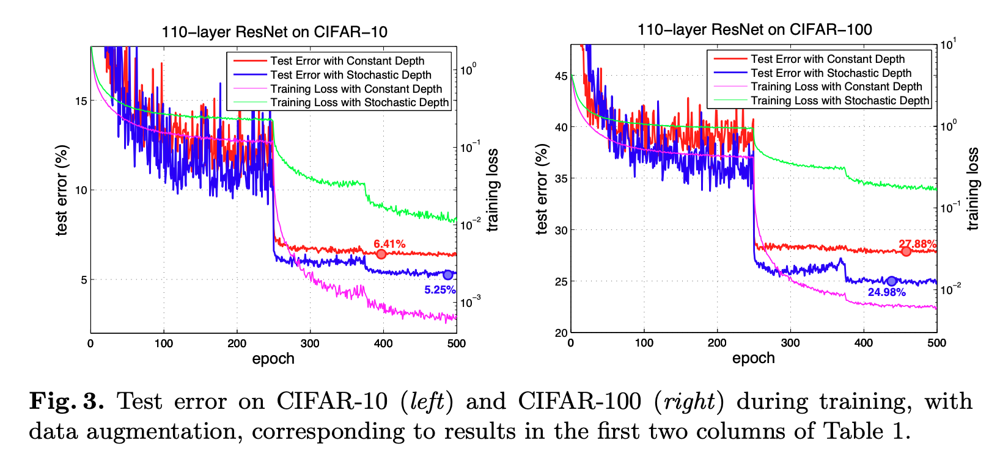
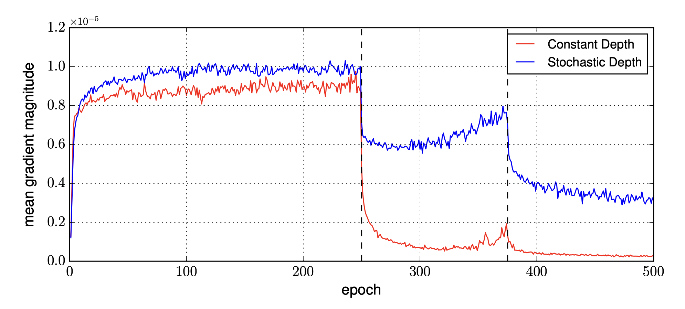
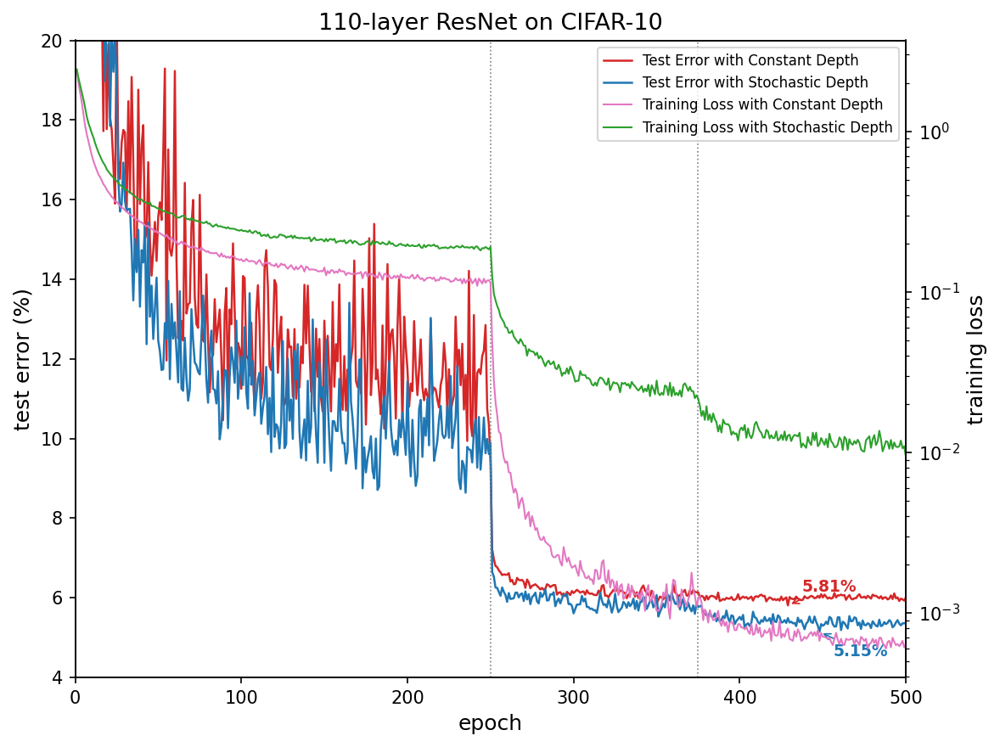
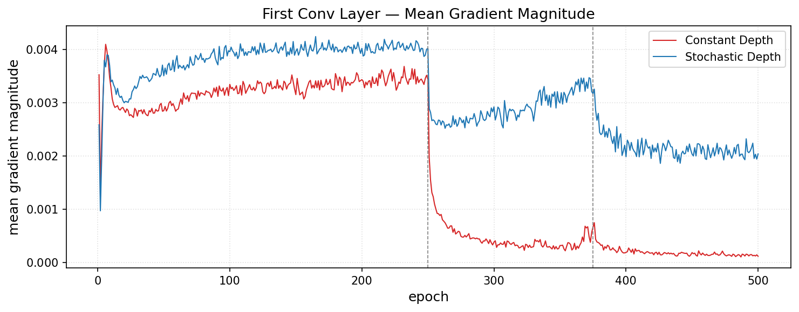

# Stochastic Depth in ResNets

This repository re-implements **Deep Networks with Stochastic Depth** (Huang et al., ECCV 2016) in PyTorch, reproducing Figure 3 (test error curves) and Figure 7 (gradient magnitude) from the paper. This project was completed as part of CS 4782 at Cornell University.

---

## 1. Introduction

This repo attempts to re-implement the paper:

> **Deep Networks with Stochastic Depth**  
> Gao Huang, Yu Sun, Zhuang Liu, Daniel Sedra, Kilian Q. Weinberger  
> ECCV 2016 · [arXiv:1603.09382](https://arxiv.org/abs/1603.09382)

The paper's main contribution is a simple training procedure: randomly drop entire residual blocks each mini-batch, bypassing them with identity skip connections. This reduces vanishing gradients, speeds up training by ~25%, and improves test error on CIFAR-10 from 6.41% (constant depth) to 5.25% (stochastic depth).

---

## 2. Chosen Result

The primary target is **Figure 3 (left)** from the paper: per-epoch test error and training loss for a 110-layer ResNet on CIFAR-10 over 500 epochs — the paper's central empirical claim. It corresponds to the first two columns of **Table 1** in the paper (CIFAR-10+ results: 6.41% constant depth, 5.25% stochastic depth).

The secondary target is **Figure 7**: mean gradient magnitude of the first convolutional layer, demonstrating that stochastic depth keeps early-layer gradients healthy throughout training while the constant-depth baseline collapses after the first learning-rate drop. This provides empirical support for the paper's core theoretical motivation — that randomly shortening the network during training reduces the vanishing gradient problem described in **Equation 4** (the linear decay rule):

$$p_\ell = 1 - \frac{\ell}{L}(1 - p_L)$$

| Model | Paper (Table 1) | Re-impl. |
|---|---|---|
| Constant depth | 6.41% | 5.81% |
| Stochastic depth | 5.25% | 5.15% |

**Original paper figures:**

<p float="left">
  
  
</p>

**Re-implementation:**

<p float="left">
  
  
</p>

---

## 3. GitHub Contents

```
.
├── code/
│   ├── model.py               # StochasticDepthNet, StochasticBlock
│   ├── data.py                # CIFAR-10 data loading and augmentation
│   ├── train.py               # Training loop with checkpointing and logging
│   ├── evaluate.py            # Load checkpoint and report test error
│   ├── confusion_analysis.py  # Per-class and pairwise confusion analysis
│   └── notebooks/
│       ├── 00_setup.ipynb     # Mount Drive, create folders, upload code
│       ├── 01_fig3.ipynb      # Train stochastic and baseline for Figure 3
│       ├── 02_fig7.ipynb      # Train with gradient logging for Figure 7
│       ├── 03_fig8.ipynb      # p_L sweep and depth heatmap (Figure 8) — not run due to compute constraints
│       ├── 04_plot.ipynb      # Generate all figures from training logs
│       └── 05_confusion.ipynb # Run confusion matrix analysis
├── data/
│   └── README.md              # Instructions for downloading CIFAR-10
├── results/
│   ├── figures/               # Generated figures (figure3.png, figure7.png, etc.)
│   └── logs/                  # JSON training logs (one per run)
├── poster/
│   └── poster.pdf
├── report/
│   └── report.pdf
├── LICENSE
├── .gitignore
└── README.md
```

---

## 4. Re-implementation Details

**Architecture.** 110-layer ResNet (6N+2, N=18): three groups of 18 residual blocks with 16/32/64 filters, a Conv-BN-ReLU stem, global average pool, and linear classifier.

**Key differences from the authors' Torch 7 code:**
- *Skip-connection projection*: the original uses average pooling + zero-channel padding (Option A); this re-implementation uses a 1×1 strided convolution + BN (Option B), a learnable projection with slightly more capacity.
- *Gate placement*: the original training loop sets a `gate` boolean on each module before every mini-batch. Here the Bernoulli draw is placed inside `StochasticBlock.forward()`, making each block self-contained with no behavioral change.

**Training.** SGD with Nesterov momentum (0.9), weight decay 1e-4, initial lr=0.1 divided by 10 at epochs 250 and 375, batch size 128, 500 epochs, 45k/5k train/val split, standard CIFAR-10 augmentation (random horizontal flip + 4-pixel random crop).

**Compute.** Trained on an NVIDIA A100 GPU via Google Colab. The authors used a TITAN X (2016); each epoch takes ~60s on A100 vs ~75s reported by the authors.

---

## 5. Reproduction Steps

### Dependencies

```bash
pip install torch torchvision scikit-learn matplotlib
```

Python 3.10+, PyTorch 2.0+, CUDA recommended.

1. Open `code/notebooks/00_setup.ipynb` and run all cells to mount Drive and upload code.
2. Open `code/notebooks/01_fig3.ipynb`. Run the **stochastic** training cell, then run the **baseline** cell. Each run takes ~8 hours on A100.
3. Open `code/notebooks/02_fig7.ipynb` and repeat for Figure 7 (adds `--log_grad` flag).
4. Once training is complete, open `code/notebooks/04_plot.ipynb` to generate figures.
5. Optionally run `code/notebooks/05_confusion.ipynb` for per-class error analysis.

**Compute requirement:** A GPU with ≥16GB VRAM is recommended. Training one 500-epoch run takes ~8 hours on an A100.

---

## 6. Results / Insights

Running the above produces test errors matching or exceeding the paper:

| Model | Paper | Re-impl. |
|---|---|---|
| Constant depth | 6.41% | 5.81% |
| Stochastic depth | 5.25% | 5.15% |
| Relative improvement ↓ | 18.1% | 15.5% |

The gradient magnitude plot reproduces the paper's key mechanistic finding: after the first learning-rate drop at epoch 250, the constant-depth baseline's gradients collapse to near zero and stay there, while stochastic depth maintains healthy gradients through epoch 500.

An additional per-class confusion analysis (not in the original paper) reveals that stochastic depth's gains are not uniform — they concentrate on semantically ambiguous class pairs (cat/dog: −0.9%, truck/automobile: −1.0%) while slightly degrading on visually distinctive classes (ship: +0.8%). This is consistent with a variance-reduction interpretation of the implicit ensemble effect.

---

## 7. Conclusion

Stochastic depth is straightforward to re-implement and robust to the minor architectural differences introduced here (Option B skip connections, internalized gate logic). The results match the paper closely. The most unexpected finding was the selective nature of the accuracy gains: stochastic depth acts as a better ensemble on hard, ambiguous boundaries rather than providing a blanket improvement, which suggests its regularization effect is fundamentally about reducing decision variance on uncertain inputs.

---

## 8. References

- Huang, G., Sun, Y., Liu, Z., Sedra, D., & Weinberger, K.Q. (2016). Deep networks with stochastic depth. *ECCV 2016*. [arXiv:1603.09382](https://arxiv.org/abs/1603.09382)
- He, K., Zhang, X., Ren, S., & Sun, J. (2016). Deep residual learning for image recognition. *CVPR 2016*. [arXiv:1512.03385](https://arxiv.org/abs/1512.03385)
- Paszke, A., et al. (2019). PyTorch: An imperative style, high-performance deep learning library. *NeurIPS 2019*.
- Original Torch 7 implementation: [github.com/yueatsprograms/Stochastic_Depth](https://github.com/yueatsprograms/Stochastic_Depth)

---

## 9. Acknowledgements

This project was completed as a final project for **CS 4782: Probabilistic Machine Learning** at Cornell University (Spring 2025). The course provided the problem setting and peer-review structure that shaped the scope and evaluation of this work. The original authors' Torch 7 code was used as a reference for verifying implementation correctness.